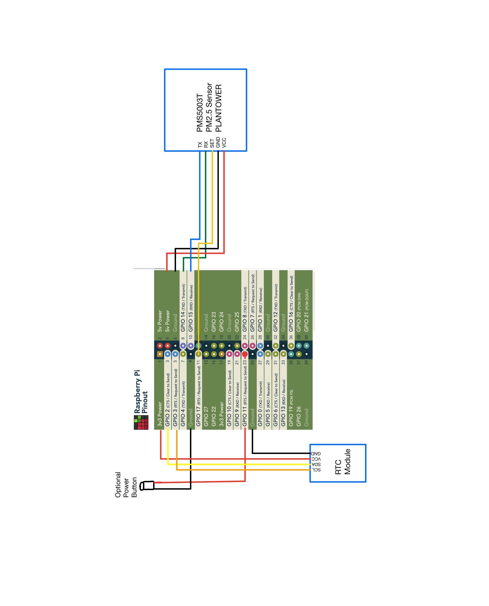

# Table of Instructions
- [1. Flash Operating System](#1-flash-operating-system)
- [2. Configure Interfaces](#2-configure-interfaces)
- [3. Update the Device](#3-update-the-device)
- [4. Install WiringPi](#4-install-wiringpi)
- [5. Setup Python Virtual Environment](#5-setup-python-virtual-environment)
- [6. Setup Cron Job](#6-setup-cron-job)
- [7. Configure Sudden Power Loss Handling](#7-configure-sudden-power-loss-handling)
- [8. Edit `config.txt`](#8-edit-configtxt)
- [9. Update Script Paths](#9-update-script-paths)
- [10. Install WiringPi](#10-install-wiringpi)
- [11. RTC Setup Steps (DS3231 on Raspberry Pi)](#11-rtc-setup-steps-ds3231-on-raspberry-pi)
- [12. Wifi hotspot](#12-wifi-hotspot)
- [13. Optional Power Savers](#13-optional-power-savers)
- [Final Checks](#final-checks)
- [Diagrams and Photos](#diagrams-and-photos)
---

# Raspberry Pi Device Setup

## 1. Flash Operating System

* Use the **Raspberry Pi Imager** to flash the OS onto the SD card.
  *This installs the base system so the Pi can boot.*

---

## 2. Configure Interfaces

Run:

```bash
sudo raspi-config
```

Enable:

* **SSH** → Allows you to connect remotely via terminal.
* **VNC** → Enables remote desktop access.
* **Serial Port** →

  * Login shell over serial: **No** (prevents console from using the port).
  * Serial hardware: **Yes** (frees up UART pins for sensors).

---

## 3. Update the Device

Make sure you have a **stable internet connection** and run:

```bash
sudo apt-get update && sudo apt-get upgrade -y
```

*This updates package lists and upgrades installed software.*

If errors occur:

```bash
sudo apt-get dist-upgrade -y
sudo apt-get upgrade -y
```

*`dist-upgrade` resolves dependency changes.*

If lock errors occur:

```bash
sudo rm /var/lib/dpkg/lock-frontend
sudo rm /var/cache/apt/archives/lock
```

*Removes leftover lock files blocking updates.*

---

## 4. Install WiringPi

* Install WiringPi (if not already bundled).
  *Provides GPIO utilities to test and manage pins.*

---

## 5. Setup Python Virtual Environment

Create and activate:

```bash
python3 -m venv venv
source venv/bin/activate
```

*Isolates project dependencies.*

Install required packages:

```bash
pip install adafruit-circuitpython-pm25 pyserial
```

* **adafruit-circuitpython-pm25** → Driver for PM2.5 sensor.
* **pyserial** → Enables communication with UART devices.

---

## 6. Setup Cron Job

Open cron for root:

```bash
sudo crontab -e
```

Add:

```bash
*/5 * * * * /home/username/venv/bin/python3 /path/to/pm25_cron_job.py >> /home/username/air_quality_cron.log 2>&1
```

* `*/5 * * * *` → Runs script every 5 minutes.
* `>> log 2>&1` → Logs both output and errors.

*Ensures automated data collection and logging.*

---

## 7. Configure Sudden Power Loss Handling

Check partitions:

```bash
blkid
```

Edit fstab:

```bash
sudo nano /etc/fstab
```

Add:

```
PARTUUID=XXXXXXXXX / ext4 defaults,noatime 0 1
```

* Replace `XXXXXXXXX` with your root partition's PARTUUID.
* `noatime` reduces write operations → extends SD card life.
* Ensures clean mount handling after unexpected power loss.

---

## 8. Edit `config.txt`

Open:

```bash
sudo nano /boot/firmware/config.txt
```

Append:

```ini
# === UART Setup: Use ttyAMA0 or ttyS0 or serial0 for the PM2.5 Sensor ===
dtoverlay=disable-bt          # Disables onboard Bluetooth so UART pins can be used
dtoverlay=pi3-disable-bt      # Extra Bluetooth disable (for Pi3/Zero family)

# === Enable Safe Shutdown Button on GPIO 11 (pin 23) ===
dtoverlay=gpio-shutdown,gpio_pin=11,active_low=1,gpio_pull=up
# Allows a button press to safely shut down the Pi and prevent SD corruption.

# === Real-Time Clock (RTC) Support ===
dtoverlay=i2c-rtc,ds3231
# Adds support for DS3231 RTC module for accurate timestamps offline.

# === Optional: Power Saving ===
dtparam=act_led_trigger=none  # Disables activity LED blinking
dtparam=act_led_activelow=on  # Keeps LED off unless explicitly controlled
hdmi_blanking=2               # Turns off HDMI if not using display

# === Enable UART ===
enable_uart=1
# Required for communication with PM2.5 sensor over serial.
```

---

## 9. Update Script Paths

In `pm25_cron_job.py`, ensure paths match username:

```python
/home/username/pm25_buffer.json
/home/username/air_quality_log.csv
```

* **Buffer JSON** → Temporary storage for sensor readings.
* **CSV log** → Long-term storage for analysis.

---


## **10. Install WiringPi**

<details>
    <summary>Install WiringPi (power button)</summary>

### **Download WiringPi**
```bash
cd ~
git clone https://github.com/WiringPi/WiringPi.git
```

### **Build and Install WiringPi**
```bash
cd WiringPi
./build
```

### **Verify Installation**
After installation, check if `gpio` is now available:
```bash
gpio -v
```
 **Expected Output (If WiringPi Installed Correctly)**:
```
gpio version: 2.XX (version may vary)
```

---

### **Test GPIO 3 (Button)**
Now check if your **shutdown button is detected**:
```bash
gpio -g mode 11 in
watch -n 0.5 gpio -g read 11
```
**Expected Behavior**
- **When button is unpressed:** Output should be `1`.
- **When button is pressed:** Output should change to `0`.

If the button does not change state, **double-check the wiring**:
- One leg **to GPIO 11 (Pin 5)**.
- One leg **to GND (Pin 6)**.

</details>


---


## 11. RTC Setup Steps (DS3231 on Raspberry Pi)

<br /> 

<details>
    <summary> RTC SETUP </summary>

### **Wiring the RTC Module**


Connect the DS3231 RTC module to Pi using the I2C interface:

| RTC Pin | Connect To (Pi GPIO) | Physical Pin |
|---------|----------------------|--------------|
| VCC     | 3.3V or 5V           | 1 or 2       |
| GND     | Ground               | 6 or 9       |
| SDA     | SDA (I2C Data)       | GPIO 2 (Pin 3) |
| SCL     | SCL (I2C Clock)      | GPIO 3 (Pin 5) |

---

### **Enable I2C Interface**
Run:

```bash
sudo raspi-config
```

- Go to **Interface Options > I2C > Enable**
- Reboot after enabling.

---

### **Verify RTC is Detected**

Run:

```bash
sudo i2cdetect -y 1
```

Output should be something like:

```
50: -- -- -- -- -- -- 57 -- ...
```

If you see `UU` or `57`, the RTC is detected and you can move on.

---

### **Edit `/boot/firmware/config.txt`**

double check you had this correctly configured):

```txt
[all]
dtoverlay=i2c-rtc,ds3231
dtoverlay=gpio-shutdown,gpio_pin=11,active_low=1,gpio_pull=up
```

Leave out `pi3-disable-bt` on Pi Zero unless needed.

---


check clock:

### **Check `hwclock`**
Check the current RTC time:
```bash
sudo hwclock
```


### **Disable Fake Hardware Clock**

```bash
sudo apt-get purge fake-hwclock
sudo systemctl disable fake-hwclock
```

This makes sure the system uses the **real** RTC instead of a simulated one.

---

### **Manually Sync Time (one-time setup)**

If the Pi currently has the correct time from Wi-Fi:

```bash
sudo hwclock -w   # Write system time to RTC
```

If the RTC had an old time:

```bash
sudo date -s "yyyy-mm-dd hour:minute:second"   # Set system time from RTC
```

Then sync system time to RTC:

```bash
sudo hwclock -w
```
*This ensures both system and RTC clocks are aligned.*

Read time from RTC to verify:

```bash
sudo hwclock -r
```
*Shows the current date/time stored on the RTC.*

Sync RTC to system time at boot:

```bash
sudo hwclock -s
```
*Sets the system clock from the RTC module*

---

### **Create Startup Sync Script (Optional)**

To sync RTC at boot and log the result:

Edit `/etc/rc.local`:

```bash
sudo nano /etc/rc.local
```

Insert **before** `exit 0`:

```bash
#!/bin/bash
/sbin/hwclock --hctosys
echo "RTC at boot: $(/sbin/hwclock -r)" >> /home/youruser/rtc_boot_check.log
```

> Make sure `/etc/rc.local` is executable:
```bash
sudo chmod +x /etc/rc.local
```

Then test:
```bash
sudo systemctl status rc-local
```

---

### **Test After Reboot with No Internet**

1. Disconnect Pi from Wi-Fi.
2. Reboot the Pi.
3. Run:
   ```bash
   date
   hwclock -r
   ```
4. Both should report the correct time.

---

### Notes

- The **RTC keeps time even when the Pi is powered off**, thanks to the onboard coin battery.
- Once set up, **you don’t no need to any additional scripts** in  cron jobs — the system clock will be correct on boot.

---
</details>


---


# 12. Wifi hotspot

<details>
    <summary> Wifi Hotspot</summary>

### Step 1: Find wifi device
`nmcli device`

### Step 2: Create hotsot network
`sudo nmcli device wifi hotspot ssid <hotspot name> password <hotspot password> ifname wlan0`

### Step 3: Configure hotspot network
`nmcli connection show <hotspot UUID>`

### Step 4: auto connect to hotspot on boot
`sudo nmcli connection modify <hotspot UUID> connection.autoconnect yes connection.autoconnect-priority 100`

</details>


---

# 13. Optional Power Savers

---

<details>
    <summary>Option Power Savers</summary>


### **Disable HDMI (saves ~25–30mA)**

You likely don’t use video output while in the field. (for in the lab or at home you may want to keep it enabled):

```bash
sudo /opt/vc/bin/tvservice -o
```

To make it automatic on boot, add this to `/etc/rc.local` (before `exit 0`):

```bash
/opt/vc/bin/tvservice -o
```

---

### **Disable LEDs (saves ~5–10mA)**

You're already controlling the **ACT LED**, but there might be others like `PWR` or `status`.

Disable in `/boot/firmware/config.txt`:

```ini
dtparam=act_led_trigger=none
dtparam=act_led_activelow=on
```

To turn it off immediately:

```bash
echo 0 | sudo tee /sys/class/leds/ACT/brightness
```

---

### **Turn Off Onboard Audio (if unused)**

```ini
# In /boot/firmware/config.txt
dtparam=audio=off
```

---

### **Disable Wi-Fi and Bluetooth (saves 30–50mA)**

If you don’t need internet in the field:

```bash
sudo rfkill block wifi
sudo rfkill block bluetooth
```


To make permanent, add to `/etc/rc.local`:

```bash
rfkill block wifi
rfkill block bluetooth
```

Or add to `config.txt`:

```ini
dtoverlay=disable-wifi
dtoverlay=disable-bt
```

---

### 5. **Shut Down Unused Services**

List active services:

```bash
systemctl list-units --type=service --state=running
```

Disable ones you don’t need (examples):

```bash
sudo systemctl disable hciuart.service
sudo systemctl disable avahi-daemon.service
```

**Only disable if you're sure you don't need the service.**

---


### **Put the Sensor to Sleep Between Readings**

If you're using the PM5003 or similar:
- Use the **SET pin (PIN3)** to put it to sleep
- Control that pin from the Pi via a GPIO output (e.g. BCM 22)
- Set LOW to sleep, HIGH to wake

This can save ~100mA between reads


---

## Estimated Summary Table: Pi Power Optimization Techniques

| Action | Savings | Safe? |
|--------|---------|-------|
| Disable HDMI | ~30 mA | ✅ Yes |
| Disable WiFi/BT | ~30–50 mA | ✅ If not needed |
| Turn off LEDs | ~10 mA | ✅ Yes |
| Sleep sensor | ~100 mA | ✅ Yes |
| Use CPU powersave | ~10–40 mA | ✅ Yes |
| Set unused GPIOs | Minor | ✅ Good practice |
| Shutdown idle services | Varies | ⚠️ Be careful |
| Sleep/shutdown Pi between jobs | Huge (most power saved) | ✅ If externally managed |

</details>

---


# Final Checks

---


---

# Diagrams and Photos
Diagrams and Photos


